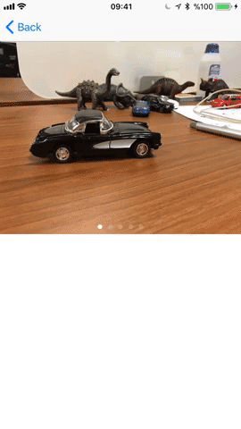

# EKMediaView

[](https://travis-ci.org/erdikanik/EKMediaView)
[](http://cocoapods.org/pods/EKMediaView)
[](http://cocoapods.org/pods/EKMediaView)
[](http://cocoapods.org/pods/EKMediaView)

## Example

<br />


To run the example project, clone the repo, and run `pod install` from the Example directory first.

## Requirements

## Installation

EKMediaView is available through [CocoaPods](http://cocoapods.org). To install
it, simply add the following line to your Podfile:

```ruby
pod 'EKMediaView', :git => 'https://github.com/erdikanik/EKMediaView.git'
```

## Author

erdikanik, erdikanik@gmail.com

## License

EKMediaView is available under the MIT license. See the LICENSE file for more info.
